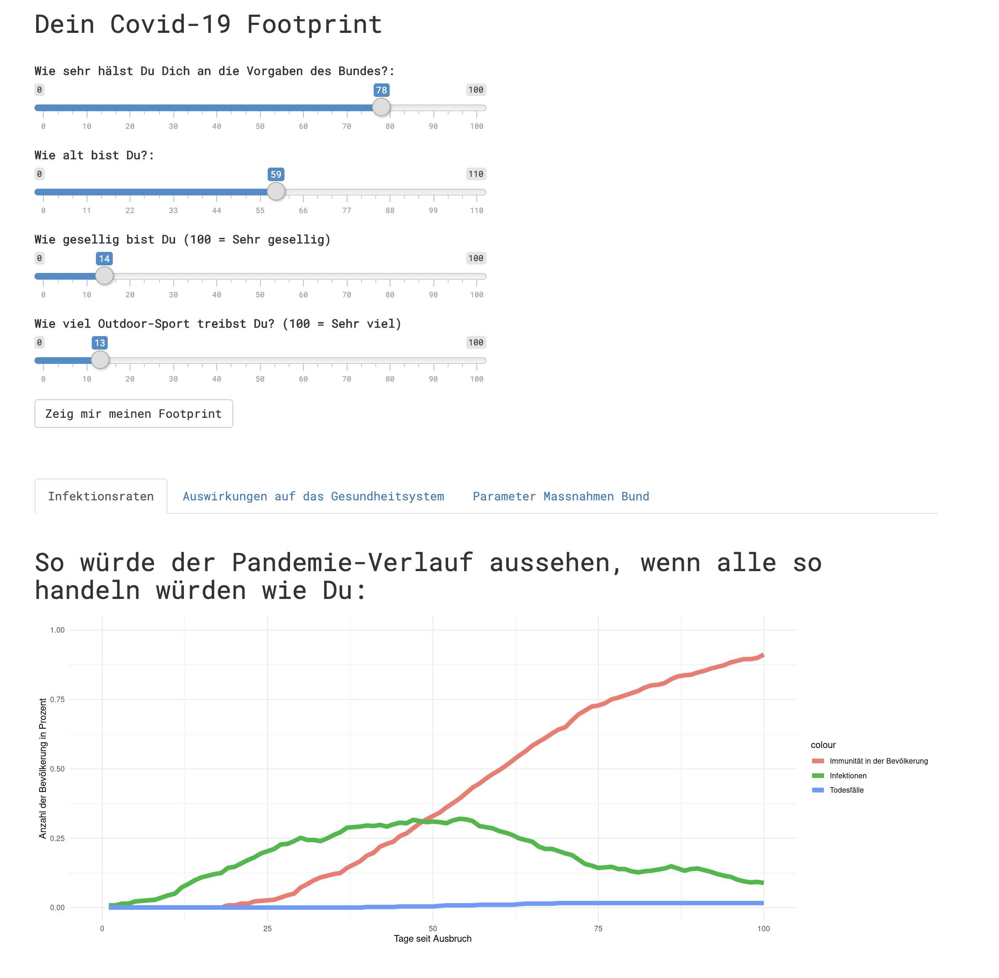
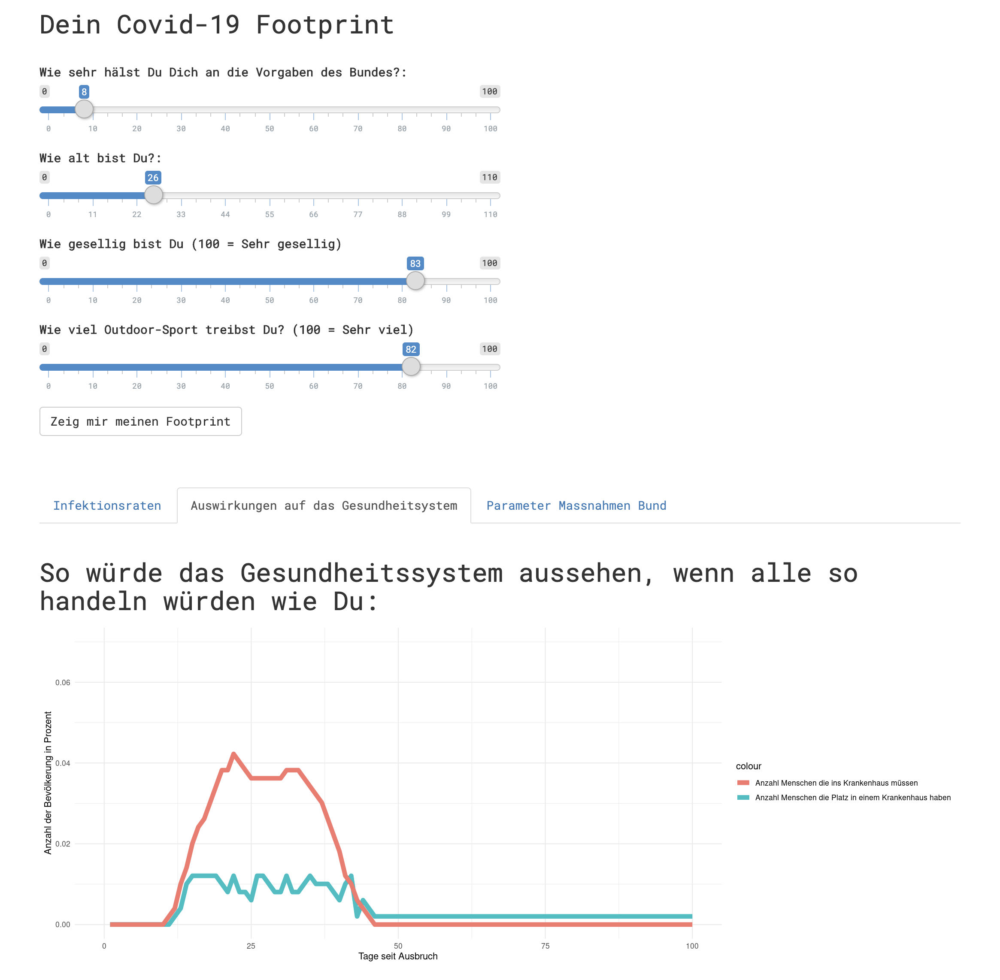

# Act-Like-Me

Our contribution to the [versusvirus hackathon](https://www.versusvirus.ch/) in Switzerland.

The idea was to visualize the importance of social distancing measures which are by now put in place in most European countries. The model takes parameters based on a users' adherence to social distancing as input and simulates how a virus would propagate if the whole population acted the same way. We hope that this will help individuals see how a small change in behavior can already have huge implications for the healthcare sector and the country as a whole.

## Under the hood

The simulation is a multi-agent stochastic interaction model. Among other things it evaluates the evolution of infection rates, immunity and death rates. It also contains an upper bound for people admittable to hospital,  thereby taking into account how a potentially overwhelmed healthcare system cannot treat every patient optimally.

The agents are arranged in a network with five connections to the closest neighbours. Initially the agents are distributed randomly. Given the connection logic, this will result in a local clustering (which seems at least somewhat more realistic than to have all agents distributed randomly). The agents interact according to an adjustable probability, which simulates how well someone acts according to the social distancing guidelines. The adherence parameter controls the probability of interaction between two nodes in the graph, but the resulting binary outcome (interaction or not) will still be random (hence the name stochastic interaction model). 

The model still contains many random parts which are sampled from a uniform, which is NOT how reality works. In general, the output of the model as it is, should also not be used for forecasting or other task which require accurate responses. We merely aim to illustrate how every individual has a responsibility in tackling this crisis. 

## How to use the model
Set the probability-of-contact variable and compare the graphs. The famous curve will most likely get flatter when social distancing is observed on a larger scale:

## Things to note

The underlying parameters have been chosen according to current COVID-19 statistics. However, this is an illustrative model only! The model aims to show how social distancing can help keeping the number of people infected (and therefore presumably the number of occupied hospital beds) within the capacity of the healthcare system. 

## Coming up

- Improve accuracy of input-parameters. 
- Parameter estimates using sampling based methods (MC). 
- include additional behavioural based parameters
- improved performance / multi-core-processing
- New UI (DONE)

## Ressources 

Current input-parameters are based on the following sources:

- https://smw.ch/article/doi/smw.2020.20203
- http://www.euro.who.int/__data/assets/pdf_file/0010/293689/Switzerland-HiT.pdf
- https://www.epicentro.iss.it/coronavirus/bollettino/Report-COVID-2019_17_marzo-v2.pdf